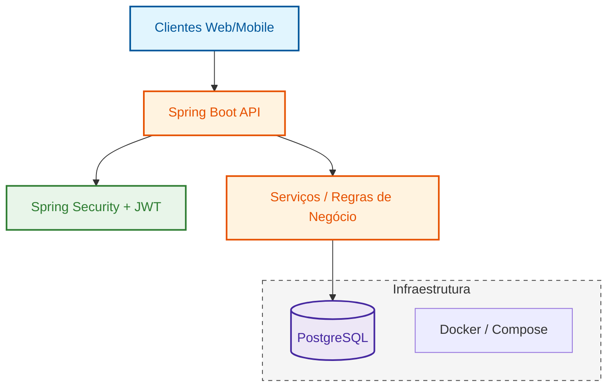

# MatchCarreira API

O **MatchCarreira** é o motor de uma plataforma de aceleração de carreira. Desenvolvido para ser resiliente e escalável, o sistema utiliza containerização e automação de banco de dados para garantir paridade entre os ambientes de desenvolvimento e produção.

### 🛠 Tech Stack

## Infraestrutura com Docker
A aplicação está pronta para rodar em ambientes isolados, garantindo que o banco de dados e as dependências subam corretamente com um único comando.

## 🏗️ Arquitetura e Engenharia

A arquitetura do **MatchCarreira** foi refatorada para eliminar a desordem técnica, agrupando responsabilidades por contexto de negócio (Domain-Driven Design simplificado):

| Contexto | Responsabilidade |
| :--- | :--- |
| 🔐 **auth** | Autenticação robusta e Recuperação de Senha. |
| 👤 **perfil** | Gestão de Currículos, Experiências e Formações. |
| ⚙️ **usuário** | Gestão de Contas e preferências do sistema. |

---

## Boas Práticas e Diferenciais Técnicos

#### Refinamento de Código
* **Padrão DTO:** Separação entre *Solicitação* (entrada) e *Resposta* (saída) para segurança dos dados.
* **Imutabilidade com Records:** Uso de *Java Records* para garantir objetos concisos e thread-safe.

#### Infraestrutura Integrada
* **Auditoria Automática:** Rastreabilidade total com campos `criado_em` e `atualizado_em` via JPA.
* **CORS & Segurança:** Configuração pronta para integração com front-ends modernos.

---
## ☁️ Cloud-Ready Development

O **MatchCarreira** está totalmente preparado para o desenvolvimento em nuvem. Graças ao **GitHub Codespaces** e **DevContainers**, você pode rodar todo o ecossistema (API + PostgreSQL + Redis) diretamente no seu navegador, eliminando a "desordem técnica" de configuração local.

## 📖 Documentação da API

Com a aplicação em execução via **Docker**, a interface interativa fica disponível para testes imediatos:

