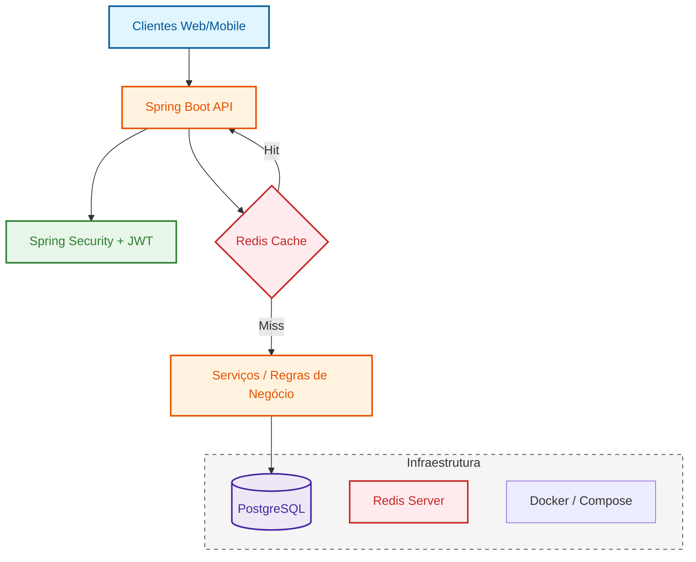

# MatchCarreira API

O **MatchCarreira** é o motor de uma plataforma de aceleração de carreira. Desenvolvido para ser resiliente e escalável, o sistema utiliza containerização, automação de banco de dados e cache em memória para garantir alta performance no processamento de perfis profissionais.

### 🛠 Tech Stack

## Infraestrutura e Fluxo de Dados
A aplicação utiliza **Redis** para cache de perfis, reduzindo drasticamente a carga no banco de dados em operações de leitura frequentes.

## 🏗️ Arquitetura e Engenharia

A arquitetura do **MatchCarreira** agrupa responsabilidades por contexto de negócio (*Bounded Contexts*):

| Contexto | Responsabilidade |
| :--- | :--- |
| 🔐 **auth** | Autenticação JWT, Registro e Recuperação de Senha. |
| 👤 **perfil** | Gestão de Currículos, Experiências, Formações e Competências. |
| ⚙️ **usuário** | Gestão de Contas e automação de criação de perfil. |

---

## Boas Práticas e Diferenciais Técnicos

#### Performance e Cache
* **Redis Integration:** Cache estratégico de perfis utilizando as anotações `@Cacheable` e `@CacheEvict`.
* **Serialização Customizada:** Suporte total a tipos `java.time` (como `LocalDate`) no Redis através da configuração do módulo `jsr310`.

####  Refinamento de Código
* **Imutabilidade com Records:** Uso de *Java Records* para a criação de DTOs concisos, seguros e imutáveis.
* **Global Exception Handling:** Tratamento centralizado de exceções (erros 404, 403, 409) para garantir respostas padronizadas e limpas.

* **Criação Reativa:** Ao realizar o cadastro de um usuário, o sistema gera automaticamente a estrutura inicial de seu currículo.
* **Padronização Flyway:** Uso de migrations versionadas para garantir a integridade do schema do banco de dados em qualquer ambiente de execução.

---
## ☁️ Cloud-Ready Development

O **MatchCarreira** está totalmente preparado para o desenvolvimento em nuvem. Graças ao **GitHub Codespaces** e **DevContainers**, você pode rodar todo o ecossistema (API + PostgreSQL + Redis) diretamente no seu navegador, eliminando a "desordem técnica" de configuração local.

## 📖 Documentação da API

Com a aplicação em execução via **Docker**, a interface interativa fica disponível para testes imediatos:

