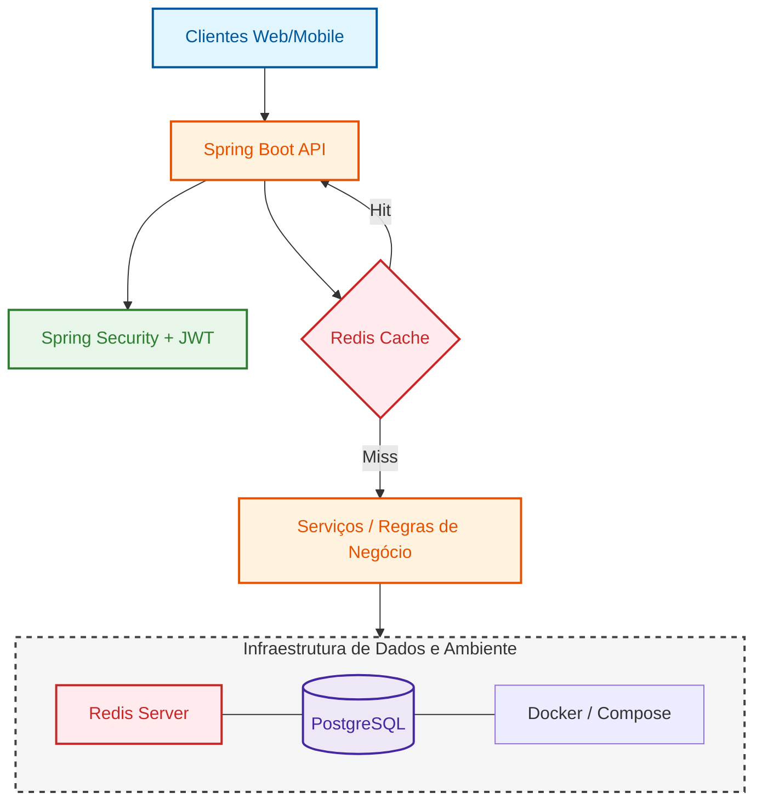

## Infraestrutura e Fluxo de Dados
A aplicação utiliza **Redis** para cache de perfis, reduzindo drasticamente a carga no banco de dados em operações de leitura frequentes.

## Contextos Delimitados (Bounded Contexts)
| Contexto | Responsabilidade |
| :--- | :--- |
| 🔐 **auth** | Autenticação JWT e Segurança. |
| 👤 **perfil** | Gestão de Currículos e Skills (Core). |
| ⚙️ **usuário** | Governança de Contas e Onboarding. |
EOF