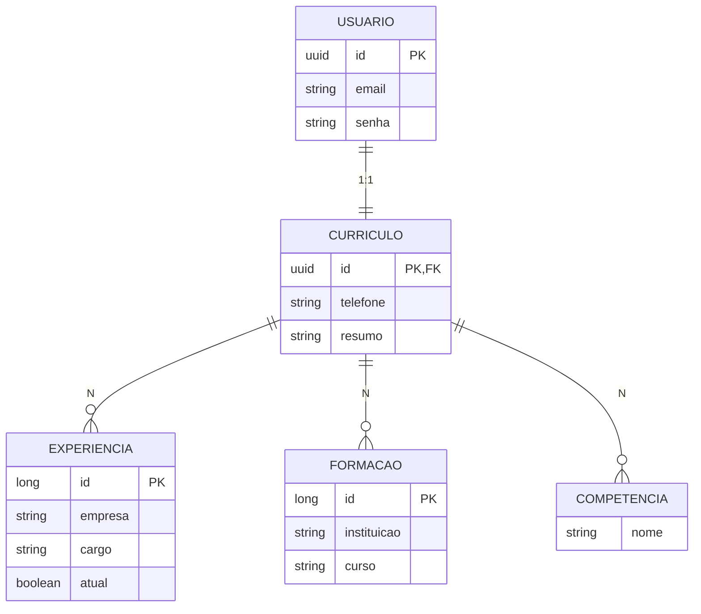

## 🗄️ Modelagem de Dados (ERD)

A persistência foi desenhada para garantir integridade referencial e performance em consultas complexas de match de competências.

```mermaid
erDiagram
    USUARIO ||--|| CURRICULO : "1:1"
    CURRICULO ||--o{ EXPERIENCIA : "N"
    CURRICULO ||--o{ FORMACAO : "N"
    CURRICULO ||--o{ COMPETENCIA : "N"

    USUARIO {
        uuid id PK
        string email
        string senha
    }

    CURRICULO {
        uuid id PK, FK
        string telefone
        string resumo
    }

    EXPERIENCIA {
        long id PK
        string empresa
        string cargo
        boolean atual
    }

    FORMACAO {
        long id PK
        string instituicao
        string curso
    }

    COMPETENCIA {
        string nome
    }
```